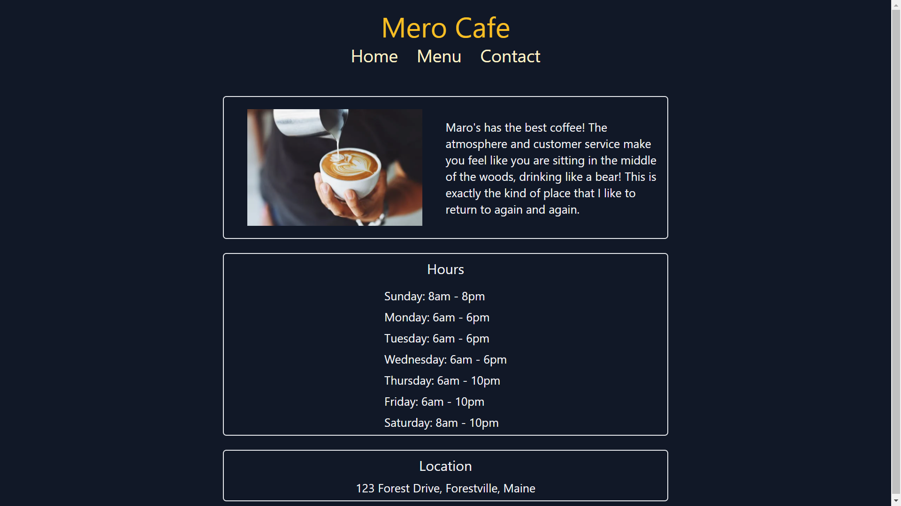

# Restaurant Page

The Mero Cafe bar is an app built with JavaScript and Webpack 

## Screenshots



## Built With 🔨
- Javascript
- Tailwind CSS
- Webpack


## Getting Started 💻

## Installation

To get a local copy of the repository please run the following commands on your terminal:

```
$ cd <folder>
```

```
$ git clone git@github.com:omar-labana/restaurant-page.git
```

## 🤝 Contributing

Contributions, issues and feature requests are welcome!

## Show your support

Give a ⭐️ if you like this project!

## Acknowledgments

-  Odin projects
-  Microverse